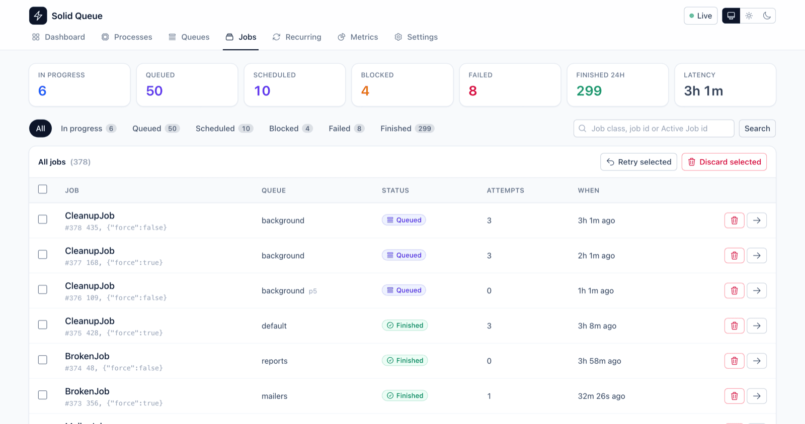
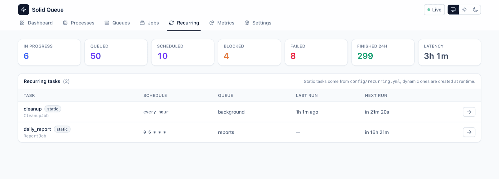

# Solid Queue Panel

A web panel for [Solid Queue](https://github.com/rails/solid_queue), in the spirit of the Sidekiq web
UI: one place to see what your workers are doing, which queues are backing up, why a job failed, and
how the whole thing is configured.

[](https://github.com/leoplct/solid-queue-panel/actions/workflows/ci.yml)
[](LICENSE.txt)


Add the gem, run the installer, sign in. No migrations, no assets to precompile, no JavaScript build,
no external requests — and a sign in page so it is never accidentally public.

## Getting started

```ruby
# Gemfile
gem "solid_queue_panel"
```

```bash
bundle install
bin/rails generate solid_queue_panel:install
```

The installer mounts the panel at `/jobs`, writes `config/initializers/solid_queue_panel.rb`, and
generates the credentials you will sign in with:

```
      create  config/initializers/solid_queue_panel.rb
 credentials  stored solid_queue_panel.password
       route  mount SolidQueuePanel::Engine => "/jobs"

Solid Queue Panel is mounted at /jobs

  Username: admin
  Password: iRFMlvTckYpnJm9YuR9v8RyK

The password is stored in your encrypted credentials. Write it down: this is the
only time it is printed.
```

Start your app, open `/jobs`, and sign in with those credentials.

```bash
bin/rails generate solid_queue_panel:install --at /admin/jobs --username leonardo
```

<p align="center">
  
</p>

### Signing in

The panel signs your browser in for **two weeks** with a signed, http-only cookie, so you type the
password once and your password manager keeps it. Sign out from the button in the navigation bar, or
change the duration:

```ruby
config.session_duration = 90.days
```

The same credentials are accepted as HTTP basic authentication, which is handy for `curl` or an
uptime check:

```bash
curl -u admin:iRFMlvTckYpnJm9YuR9v8RyK https://example.com/jobs
```

### Where the password lives

The installer stores it in your [encrypted credentials](https://guides.rubyonrails.org/security.html#custom-credentials),
under `solid_queue_panel.password`, and the generated initializer reads it from there — or from the
environment, which wins when both are set:

```ruby
config.username = ENV.fetch("SOLID_QUEUE_PANEL_USERNAME", "admin")
config.password = ENV.fetch("SOLID_QUEUE_PANEL_PASSWORD") { Rails.application.credentials.dig(:solid_queue_panel, :password) }
```

If your application has no master key, set `SOLID_QUEUE_PANEL_PASSWORD` in the environment of every
process that serves the panel instead.

### Changing the password

```bash
bin/rails solid_queue_panel:password
```

It prints a fresh random password and where to put it. Changing the password signs every browser out.

```bash
bin/rails credentials:edit   # to store the new one
```

### Other ways to protect it

Setting a username and a password turns the sign in form on. If your application already knows who
its administrators are, skip it and mount the panel behind your own authentication instead:

```ruby
# config/routes.rb
authenticate :user, ->(user) { user.admin? } do  # Devise
  mount SolidQueuePanel::Engine => "/jobs"
end
```

```ruby
# config/initializers/solid_queue_panel.rb — the block runs in the controller
config.authenticate_with { redirect_to(main_app.root_path) unless current_user&.admin? }
```

And whatever you pick, a panel that only needs to be watched can be made harmless:

```ruby
config.read_only = true   # hides and refuses retry, discard, pause, resume, clear, prune
```

> [!WARNING]
> Leaving `username` and `password` blank, with no `authenticate_with` block and no route constraint,
> leaves the panel open to anyone who can reach the URL. It can pause queues and discard jobs.

## What you get

| Page | What it shows |
| --- | --- |
| **Dashboard** | Live counters, a throughput chart of jobs enqueued, finished and failed, with arrival and completion rates so you can see at a glance whether the workers are keeping up. Plus the busiest queues, the running processes, the latest failures, and alerts when something is silently wrong (no worker running, dead processes, paused queues, wrong Active Job adapter). |
| **Processes** | Supervisors with their workers, dispatchers and schedulers: queues polled, thread pool size and how much of it is busy, polling interval, heartbeat, and every job currently running. Dead processes can be pruned from here. |
| **Queues** | Per queue counters and a backlog bar broken down by state, plus latency — how long the oldest job has been waiting. Queues can be paused, resumed and cleared. |
| **Queue detail** | The jobs of a single queue, filtered by state: the fastest way to answer "what is stuck in this queue?". |
| **Jobs** | Every job, filtered by state, queue or search (job class, job id or Active Job id), with retry, run now, discard and bulk actions. |
| **Job detail** | The Active Job payload, timings, attempts, concurrency key, the worker running it, and the full error with backtrace when it failed. |
| **Recurring** | Recurring tasks with their schedule, target, queue, last run and next run, plus the latest runs of each task. |
| **Metrics** | Per job class: enqueued, finished, failed, failure rate, jobs in progress, average and total time, over a configurable period. |
| **Settings** | The whole Solid Queue configuration with an explanation of every setting, the processes Solid Queue would start, the contents of `config/queue.yml` and `config/recurring.yml`, the database the queue lives in, and the versions in use. |

Every page refreshes itself while you watch it, in light or dark theme, and works down to a phone
screen.

### Screenshots

<table>
  <tr>
    <td width="50%"><a href="docs/screenshots/queues.png"></a><br><em>Queues, with backlog bars and latency</em></td>
    <td width="50%"><a href="docs/screenshots/processes.png"></a><br><em>Processes, threads and jobs in progress</em></td>
  </tr>
  <tr>
    <td width="50%"><a href="docs/screenshots/jobs.png"></a><br><em>Jobs, filtered by state, with bulk actions</em></td>
    <td width="50%"><a href="docs/screenshots/job.png"></a><br><em>A failed job, with payload and backtrace</em></td>
  </tr>
  <tr>
    <td width="50%"><a href="docs/screenshots/metrics.png"></a><br><em>Metrics per job class</em></td>
    <td width="50%"><a href="docs/screenshots/settings.png"></a><br><em>Settings: the whole Solid Queue configuration</em></td>
  </tr>
  <tr>
    <td width="50%"><a href="docs/screenshots/recurring.png"></a><br><em>Recurring tasks and their next run</em></td>
    <td width="50%"><a href="docs/screenshots/dashboard-dark.png"></a><br><em>Dark theme, following the system by default</em></td>
  </tr>
</table>

## Requirements

- Ruby 3.2 or newer
- Rails 7.2 or newer
- Solid Queue 1.0 or newer

## Installing by hand

If you would rather not run the generator:

```ruby
# config/routes.rb
mount SolidQueuePanel::Engine => "/jobs"
```

```ruby
# config/initializers/solid_queue_panel.rb
SolidQueuePanel.configure do |config|
  config.username = ENV["SOLID_QUEUE_PANEL_USERNAME"]
  config.password = ENV["SOLID_QUEUE_PANEL_PASSWORD"]
end
```

That is the whole installation. The panel reads the tables Solid Queue already has, and serves its
own CSS and JavaScript from the gem, so there is nothing to migrate and nothing to add to your asset
pipeline (it works the same with Propshaft, Sprockets or neither).

## Configuration

Everything is optional except the credentials. These are the defaults:

```ruby
SolidQueuePanel.configure do |config|
  # Sign in credentials. Both must be set for the sign in form to be enabled.
  config.username = nil
  config.password = nil

  # How long a browser stays signed in.
  config.session_duration = 2.weeks

  # Name shown in the navigation bar, next to the logo.
  config.application_name = nil

  # Rows per page in every table.
  config.page_size = 25

  # Seconds between two live refreshes. Set to 0 to disable polling entirely.
  config.polling_interval = 5

  # Hide and refuse every destructive action.
  config.read_only = false

  # Periods (in hours) offered by the dashboard and metrics time filters.
  config.time_periods = [ 1, 6, 24, 24 * 7 ]

  # Controller the panel controllers inherit from. Use it to reuse the
  # authentication, layout or callbacks of your own admin section.
  config.base_controller_class = "ActionController::Base"

  # Authenticate with the host application instead of the sign in form.
  # config.authenticate_with { redirect_to(main_app.root_path) unless current_user&.admin? }
end
```

Visitors can switch between the light, dark and system themes, and pause the live refresh, from the
navigation bar. Both choices are remembered in their browser.

## Notes for large installations

The panel is built to stay cheap on databases with millions of jobs:

- Counters that could scan a large table are bounded. "Finished 24h" counts the last day only, using
  the index on `finished_at`.
- Queue counters are collected with a handful of grouped queries, whatever the number of queues.
- The throughput chart buckets timestamps in SQL (PostgreSQL, MySQL/MariaDB and SQLite), so it never
  loads a day worth of rows into memory.
- Metrics average durations over the most recent 5,000 finished jobs of the period, and say so in the
  page when the sample is capped.
- Live refresh is a single request per interval, it pauses while you are typing or selecting rows,
  and it stops when the tab is in the background. Raise `polling_interval` or set it to `0` if you
  want less traffic.

Two things to know about the data itself, both coming from Solid Queue rather than from this gem:

- Finished jobs are only visible while they are kept. If `SolidQueue.preserve_finished_jobs` is
  disabled, the finished tab, the chart and the metrics have nothing to show, and the panel says so
  instead of pretending everything is idle.
- Solid Queue does not record when a job *started* running, so durations are measured from enqueue to
  completion and include the time spent waiting in the queue.

## Multi-database setups

Nothing to do. The panel talks to Solid Queue's own models, so it follows whatever
`SolidQueue.connects_to` (or `config.solid_queue.connects_to`) points at, including a dedicated queue
database.

## Coming from Sidekiq

| Sidekiq | Here |
| --- | --- |
| Busy | **Processes**, with the jobs in progress at the bottom |
| Queues | **Queues** |
| Retries | **Jobs → Scheduled**: Solid Queue re-schedules a job for its next attempt |
| Scheduled | **Jobs → Scheduled** |
| Dead | **Jobs → Failed**: Solid Queue keeps failed jobs until you retry or discard them |
| Metrics | **Metrics** |
| Cron jobs (Sidekiq Enterprise) | **Recurring** |
| — | **Settings**, which has no Sidekiq equivalent |

Solid Queue also has a state Sidekiq does not: **blocked** jobs, waiting on a concurrency limit, get
their own tab and counter.

## Development

```bash
git clone https://github.com/leoplct/solid-queue-panel.git
cd solid-queue-panel
bundle install

bin/dev            # dummy app with a seeded queue, on http://localhost:3010
bundle exec rake test
bundle exec rubocop
```

`bin/dev` rebuilds the CSS, recreates the dummy application's database, fills it with a realistic mix
of jobs, processes and recurring tasks, and starts the server.

The stylesheet is Tailwind CSS v4, built from `app/assets/stylesheets/solid_queue_panel/application.css`
into `app/assets/builds/solid_queue_panel.css`, which is committed so the gem needs no build step when
installed. After changing any view or helper class:

```bash
bundle exec rake tailwind:build   # or rake tailwind:watch while working
```

## Contributing

Bug reports and pull requests are welcome on GitHub. Please run `bundle exec rake test` and
`bundle exec rubocop` before opening one, and rebuild the CSS bundle if you touched the markup.

## Credits

- [Solid Queue](https://github.com/rails/solid_queue), by 37signals, which does all the actual work.
- The [Sidekiq](https://github.com/sidekiq/sidekiq) web UI, for setting the standard this panel aims
  at, and the [RabbitMQ management UI](https://www.rabbitmq.com/docs/management), for the idea of
  charting arrivals next to completions.
- [Heroicons](https://heroicons.com), MIT licensed, inlined into the gem.

## License

Released under the [MIT License](LICENSE.txt).
